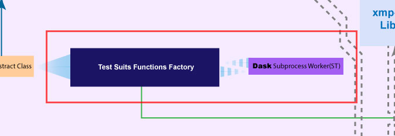
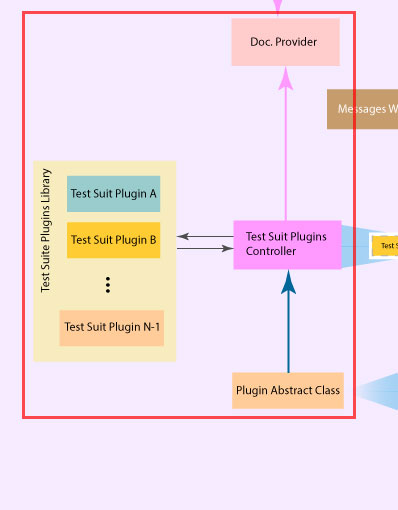
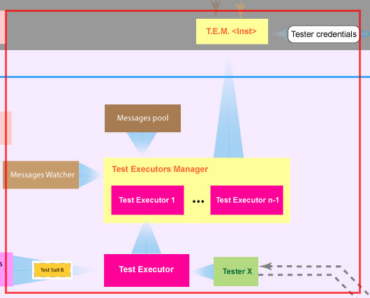

 [](https://pypi.python.org/pypi/xoa-core) 
# Xena OpenAutomation Core
Xena OpenAutomation (XOA) Core is the framework for managing testing resources and executing of different test suites.


## Framework Architecture


## Description

The XOA Core is an asynchronous Python library which can be represented by 4 subparts:
1. Resources Management System
2. Test Suite Function Factory
3. Test Suite Plugin System
4. Test Execution System

### 1. Resources Management System


The key functionality is represented in managing and monitoring the state of known testing resources.
Under the hood is uses instance of the **xmp-truck** library as an representation of the resource. 

> Note:
> [XOA Python API library](https://github.com/xenadevel/xena-open-automation-python-api) (PyPi package name [`xoa_driver`](https://pypi.org/project/xoa-driver/)) is treated as a 3rd party dependency, whose source code is not included in to XOA Core.

#### Use Case Description
1. Test resources monitoring - a pool of reserved tester credentials
	- Add - attach new tester information in to inventory.
	- Remove - remove an tester information from the inventory, disconnect and pop resource from the stack of the resources.
	- Retrieve list - get a list of all testers from database and extend it with values from serialized connected testers.
	- Retrieve connection credentials of an connected tester.
	- Update connection configurations

#### Examples
Example of data retrieved from UI
```python
{
	"host": "192.168.1.199", # tester ip
	"port": 22606, # tester port
	"password": "xena", # tester logon password
	"ss_host_id": "xxxxxx" # SessionHost identifier
}

```

Example of data passed for add new tester
```python
{
	"host": "192.168.1.199", # tester ip
	"port": 22606, # tester port
	"password": "xena", # tester logon password
}
```

Example of data after connection established
```python
{
	"idx": 1, 
	"name":  "Valkyrie Tester",
	"comment": "L23 live demo",
	"host": "192.168.1.199", # tester ip
	"port": 22606, # tester port
	"password": "xena", # tester logon password
	"modules": [
		{
			"name": "Odin-10G-5S-6P-CU",
			"reserved_by": "",
			"ports": [
				{
					"id": "P-0-0-0",
					"name": "10GBASE-T",
					"reserved_by": "MrCrab",
					"sync_status": True,
					"work_status": False
				},
				{
					"id": "P-0-0-1",
					"name": "10GBASE-T",
					"reserved_by": "Bob",
					"sync_status": True,
					"work_status": True
				}
			]
		},
		{
			"name": "Odin-10G-5S-6P-CU",
			"reserved_by": "",
			"ports": [
				{
					"id": "P-0-1-0",
					"name": "10GBASE-T",
					"reserved_by": "MrCrab",
					"sync_status": True,
					"work_status": False
				},
				{
					"id": "P-0-1-1",
					"name": "10GBASE-T",
					"reserved_by": "",
					"sync_status": True,
					"work_status":  False
				}
			]
		},
	]
}
```

Example of data after tester disconnection
```python
{
	"idx": 1, 
	"name":  "Valkyrie Tester",
	"comment": "L23 live demo",
	"host": "192.168.1.199", # tester ip
	"port": 22606, # tester port
	"password": "xena", # tester logon password
	"modules": []
}
```


### 2. Test Suit Function Factory


### 3. Test Suit Plugin System



### 4. Test execution System
