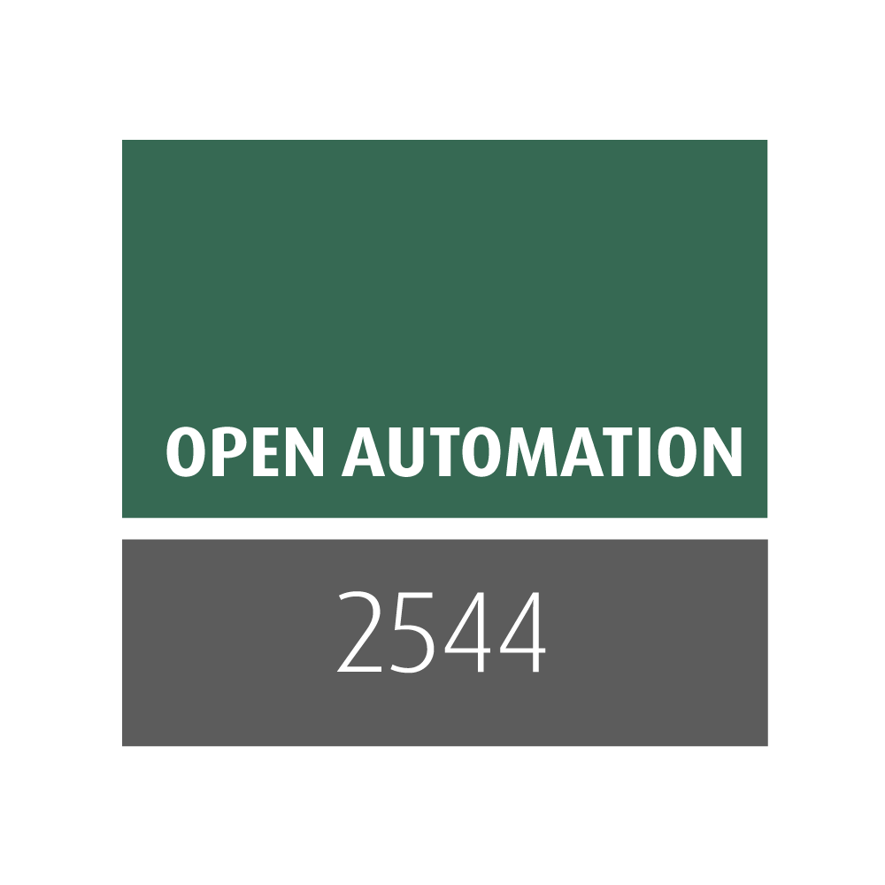
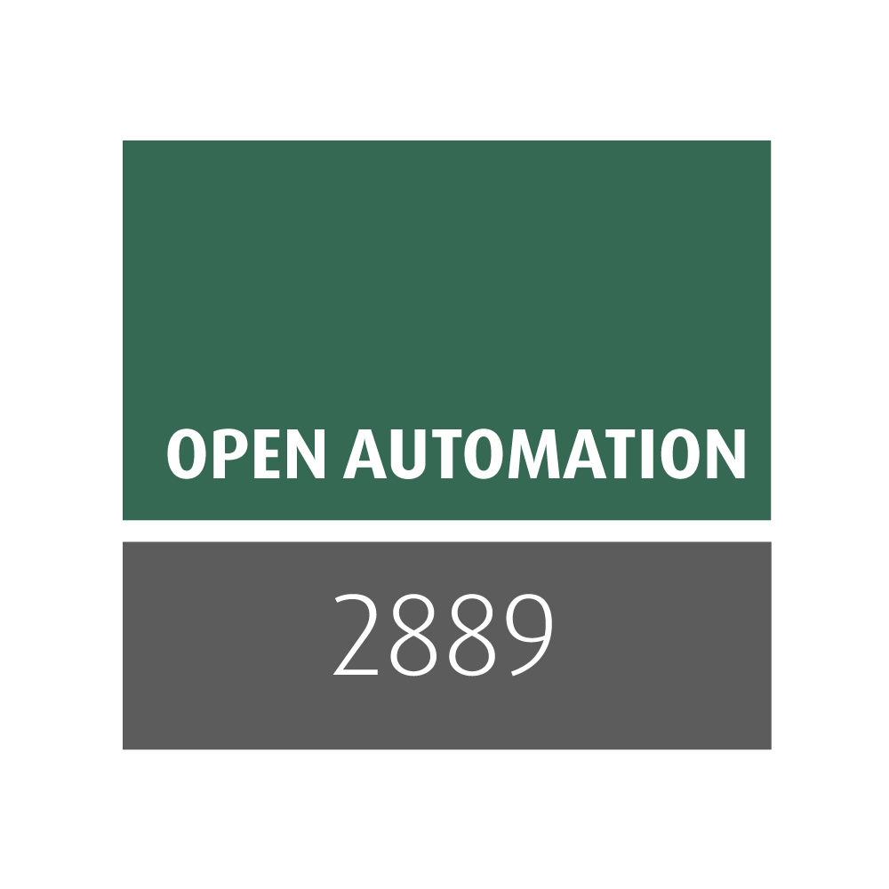
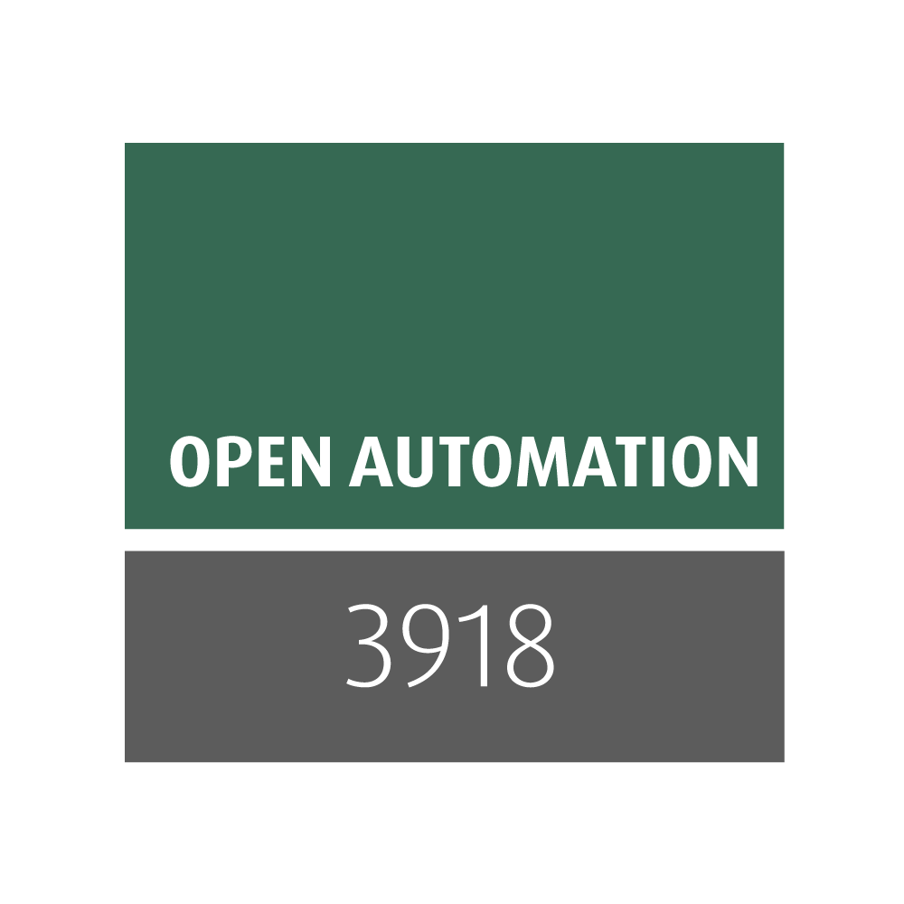

Introduction
============

Xena OpenAutomation Core (:term:`XOA Core`) is the framework that provides a standardized way for developers and test specialists to develop, integrate, and execute test suites, as well as managing Xena's physical and virtual testers.

XOA Core uses `XOA Python API <https://github.com/xenanetworks/open-automation-python-api>`_ as its fundamental driver to communicate with Xena testers. XOA Core also provides a set of standardized interfaces for users to send test configurations, receive test results, receive communication message with testers, as well as manage testers.

**Test suites are considered as plug-ins in XOA Core**, regardless whether they are developed by Xena or you. XOA Core dynamically loads test suites that are organized in a common structure, and exposes information of those test suites to the user.

We open the source code of XOA Core to empower users with the freedom to tailor the code to their unique needs, develop and integrate their own test suites, not only the Xena-developed test suites.

To keep the repository easy to manage, **we keep XOA test suites in another repository**: `XOA Test Suites <https://github.com/xenanetworks/open-automation-test-suites>`_.

XOA Test Suite Plugin Library is the public repository includes multiple automated benchmarking tests and compliance tests, such as RFC 2544, RFC 2889, RFC 3918, and all that will be published in future releases.

To use the test methodologies in XOA Test Suite Plugin Library, you need to install XOA Core.

