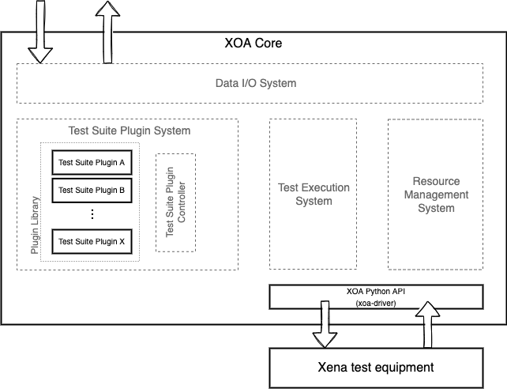

Introduction
=============

The XOA Core is an asynchronous Python framework that can be represented by four subsystems:

1. :doc:`resource_mgt_sys` lets you manage testers, i.e. add, remove, connect, disconnect, and view a list of available testers.

2. :doc:`ts_plugin_sys` dynamically loads the test suites that are organized in a common structure, and exposes information of those test suites to you.

3. :doc:`test_exec_sys` provides methods that let you control the test execution.

4. :doc:`data_io_sys` let you subscribe to different messages generated by different test suites and subsystems so you can get test statistics/results, monitor test progress, receiver errors and warnings, etc.

