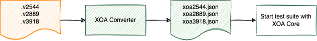

Migrate from Valkyrie Test Suites
====================================

Xena's test suite applications have only been for Windows platform for a long time. Moving forward, all of Xena's existing and future test suites will be included in Xena OpenAutomation, which is not limited to Windows anymore. 

We have developed a test configuration converter, `XOA Converter <https://docs.xenanetworks.com/projects/xoa-config-converter/>`_, to help users easily migrate their existing Windows test suite configurations ( `.v2544` for :term:`Valkyrie2544`, `.v2889` for :term:`Valkyrie2889`, `.v3918` for :term:`Valkyrie3918`, and `.v1564` for :term:`Valkyrie1564`) into XOA. The illustration below may help you understand the use flow. 

For users of XOA who only uses the web GUI to create, import and run tests, there is no need to use this Python package, because XOA Core is already using this converter.

This converter is meant for those who want to integrate XOA test suites into their own Python environment without using the web GUI at all.

.. note::

    The purpose of XOA Converter is **ONLY** to convert Xena Valkyrie test suit applications' configuration files into XOA's configuration files. Thus only four test suite types are supported by XOA Converter as the source config files. 

